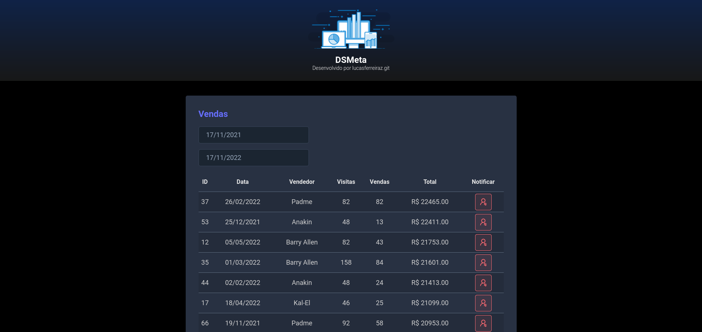

<h1 align="center"><b> DSMeta</b></h1>

<div align="center">


</div>

<h1 align="center"></h1>

## About 📚

The **DSMeta** project was developed during the **11th Edition of DevSuperior's Spring React Week** event. During the course, the basic concepts of the **Spring framework** were covered in the construction of endpoints of a **Rest API** in the **backend** and the **React** base in the composition of the **frontend**, putting everything into practice in the development of this project, **DSMeta**. A fictional service that lists sales with SMS notification.

---

## Technologies Used 🚀

- **Java**
- **Spring**
- **Maven**
- **JPA / Hibernate**
- **H2 Database**
- **React**
- **TypeScript**
- **Axios**

Auxiliary dependencies can be found at: [dependencies](https://github.com/gustavooquinteiro/dsmeta/network/dependencies).

---

## Layout 🔖

The design of the **DSMeta** project was based on the prototype made in the **Figma** tool, which includes **responsive designs** in other screen formats. The browser file can be accessed below.
- **[Project Design File](https://www.figma.com/file/EN1zFtk4eY3Jgmpgi9YaMG/DSMeta1?node-id=0%3A1)**

---

## Endpoints 🔗

For this project two endpoints were designed: <br>

<details open>

<summary><b>Show Sellers:</b> <code>GET localhost/sales</code></summary>

## Show Paginated Sellers List

Returns an object containing a paginated list of the top 20 sellers in the database if the date range is not passed as a parameter in the endpoint call.

**Method** : `GET`

**URL** : `localhost/sales`

### OR

**URL** : `localhost/sales/?minDate=yyyy-MM-dd&maxDate=yyyy-MM-dd`

## Success Response

**Code** : `200 OK`

**Content example:**

```json
{
    "content": [
        {
            "id": 37,
            "sellerName": "Padme",
            "visited": 82,
            "deals": 82,
            "amount": 22465.0,
            "date": "2022-02-27"
        },

        
        "."
        "."
        "."
        
        
        {
            "id": 26,
            "sellerName": "Kal-El",
            "visited": 21,
            "deals": 20,
            "amount": 17126.0,
            "date": "2022-04-03"
        },
        {
            "id": 25,
            "sellerName": "Anakin",
            "visited": 68,
            "deals": 43,
            "amount": 17016.0,
            "date": "2022-04-07"
        }
    ],
    "pageable": {
        "sort": {
            "sorted": false,
            "empty": true,
            "unsorted": true
        },
        "pageNumber": 0,
        "pageSize": 20,
        "offset": 0,
        "paged": true,
        "unpaged": false
    },
    "totalPages": 4,
    "totalElements": 66,
    "last": false,
    "sort": {
        "sorted": false,
        "empty": true,
        "unsorted": true
    },
    "size": 20,
    "number": 0,
    "numberOfElements": 20,
    "first": true,
    "empty": false
}
```
</details>

<details open>

<summary><b>Send Notification:</b> <code>GET localhost/sales/{id}/notification</code></summary>

Send the SMS informing the seller's name, total sales value in the month and the date.

**Method** : `GET`

**URL** : `localhost/sales/{id}/notification`

**Code** : `200 OK`

</details>


<p align="center" style="font-weight:bolder">
    Developed with 💜 by <a href="https://github.com/gustavooquinteiro">Gustavo Quinteiro</a>
</p>
